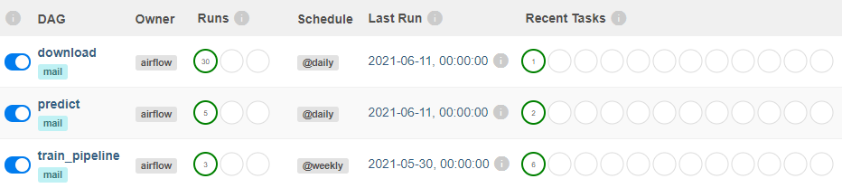
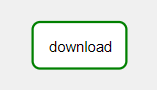
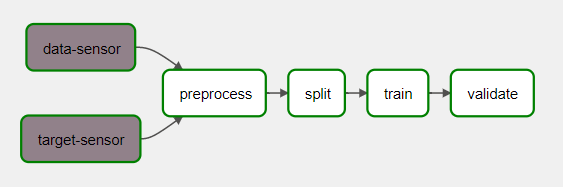
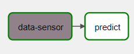

Поднять локально Airflow через docker-compose:
~~~
docker-compose up
~~~
Потребуется добавить переменные в Admin -> Variables: 
**Key**: data_dir, **Val**: full/path/to/host/data/dir -- *полный путь к папке data на локальной машине пользователя (например, C:/Users/username/data)* 
**Key**: model_dir, **Val**: relative/path/to/model/dir -- *относительный путь к папке с моделью, которую пользователь выбирает для использования в предсказаниях (например, data/models/2021-06-15)* 
**Key**: transformer_dir, **Val**: relative/path/to/transformer/dir -- *относительный путь к папке с трансформером (например, data/processed/2021-06-15)* 

Потребуется добавить соединение в Admin -> Connections (для FileSensor): 
**Conn Id**: fs_default, **Conn Type**: File (path) 

Список дагов: 

Графы дагов: 

Самооценка:

| №   | Task | Max | Fact |
|:--- | ------ | ---:| ----:|
|   0 | Поднять локально Airflow через docker-compose | 0 | 0 |
|   1 | Реализовать DAG, который генерирует данные для обучения модели | 5 | 5 |
|   2 | Реализовать DAG, который обучает модель еженедельно (preprocess, split, train, validate) | 10 | 10 |
|   3 | Реализовать DAG, который использует модель ежедневно | 5 | 5 |
|  3a | [EXTRA] Реализовать сенсоры на готовность данных | 3 | 3 |
|   4 | Все даги реализованы через DockerOperator | 10 | 10 |
|   5 | Протестировать даги | 5 | 0 |
|   6 | [EXTRA] Поднять MLflow | 5 | 0 |
|   7 | [EXTRA] MLflow Model Registry вместо Airflow variables | 5 | 0 |
|   8 | [EXTRA] Настроить alert в случае падения дага | 3 | 0 |
|   9 | Самооценка | 1 | 1 |
|     | **TOTAL** | | **34** |

