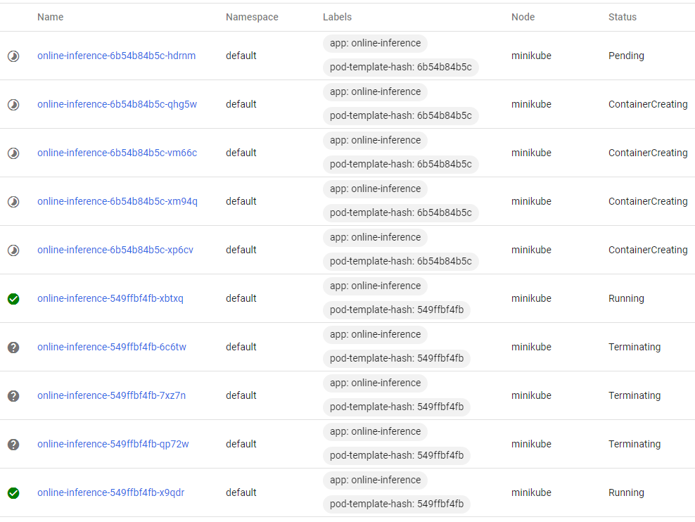

## HW 4: Kubernetes
После установки [kubectl](https://kubernetes.io/docs/tasks/tools/) и [minikube](https://minikube.sigs.k8s.io/docs/start/) (Windows 10):
~~~
minikube start
~~~
Проверка наличия кластера:
~~~
kubectl cluster-info
~~~

Создание и публикация образа приложения из hw2; создание пода на основе этого образа:
~~~
docker build -f src/Dockerfile -t lkudrenok/online-inference:v1 .
docker push lkudrenok/online-inference:v1

kubectl apply -f manifests/online-inference-pod.yaml
kubectl get pods
~~~

Создание и публикация образа приложения, которое подгружает модель 25 сек. и "падает" через 90 сек.; 
создание пода с readiness/liveness probes на основе этого образа:
~~~
docker build -f src/Dockerfile_ill -t lkudrenok/online-inference-ill:v1 .
docker push lkudrenok/online-inference-ill:v1

kubectl apply -f manifests/online-inference-pod-probes.yaml
kubectl get pods --watch
~~~

Публикация приложения из hw2 с тегом v2; создание replicaset с 3 репликами:
~~~
docker tag lkudrenok/online-inference:v1 lkudrenok/online-inference:v2
docker push lkudrenok/online-inference:v2

kubectl apply -f manifests/online-inference-replicaset.yaml
kubectl get rs
~~~

Создадим манифест для deployment, где изначально укажем версию v1, а для стратегии RollingUpdate укажем одинаковое значение replicas и maxSurge (= 5), а maxUnavailable = 0. 
Если изменить в манифесте версию на v2 и сделать новый apply, то увидим, что старые контейнеры начинают удаляться только после того, как запустятся новые. 
В итоге останется 5 контейнеров с новой версией v2.
~~~
kubectl apply -f manifests/online-inference-deployment-blue-green.yaml
~~~

Создадим манифест для deployment, где изначально укажем версию v1, replicas=5, maxSurge=4, maxUnavailable=3. 
Если изменить в манифесте версию на v2 и сделать новый apply, то увидим, что 3 старых контейнера начнут удаляться (т.е. в количестве maxUnavailable) и 4 новых начнут создаваться (т.е. в количестве maxSurge). 
В итоге останется 5 контейнеров с новой версией v2.
~~~
kubectl apply -f manifests/online-inference-deployment-rolling-update.yaml
~~~

Самооценка:

| №   | Task | Max | Fact |
|:--- | ------ | ---:| ----:|
|   0 | Установить kubectl | 0 | 0 |
|   1 | Развернуть kubernetes (выбран **minikube**) | 5 | 5 |
|   2 | Написать простой pod manifest *(online-inference-pod.yaml)* и задеплойте в кластер | 4 | 4 |
|  2a | Прописать requests/limits *(online-inference-pod-resources.yaml)* и написать в PR, зачем это нужно | 2 | 2 |
|   3 | Модифицировать app, добавить liveness/readiness пробы *(online-inference-pod-probes.yaml)*, описать в PR результат | 3 | 3 |
|   4 | Создать replicaset *(manifests/online-inference-replicaset.yaml)*, ответить в PR на вопросы | 3 | 3 |
|   5 | Создать deployment *(online-inference-deployment-blue-green.yaml, online-inference-deployment-rolling-update.yaml)*, ответить в PR на вопросы | 3 | 3 |
|     | **TOTAL** | | **20** |
