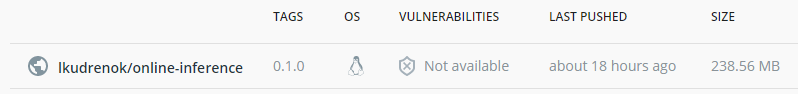
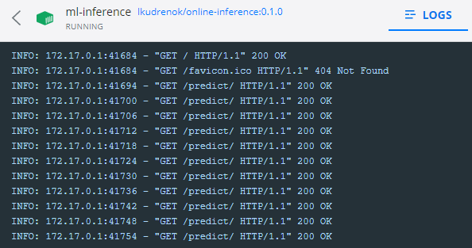

### HW 2 (REST + DOCKER)

Сборка docker-образа:
~~~
docker build -t lkudrenok/online-inference:0.1.0 .
~~~
 
Публикация образа на docker-hub:
~~~
docker push lkudrenok/online-inference:0.1.0
~~~
 
https://hub.docker.com/repository/docker/lkudrenok/online-inference

Pull с докер-хаба:
~~~
docker pull lkudrenok/online-inference:0.1.0
~~~
Запуск контейнера:
~~~
docker run -p 80:80 --name ml-inference lkudrenok/online-inference:0.1.0
~~~
Отправка запросов проходит успешно: 
 

Оптимизация размера docker image:
- изначально образ весил около 1.3 ГБ;
- в Dockerfile изменила <code>FROM python:3.9</code> на <code>FROM python:3.9-slim</code> - образ стал весить под 600 МБ;
- оптимизация импорта и кода (через setup.py) дала еще дополнительно 20-30 МБ.

Самооценка:

0. - [x] назвать ветку homework2, код - в папку online_inference
1. - [x] обернуть inference в REST сервис (FastAPI/Flask) с endpoint '/predict' ***(max/fact: +3)***
2. - [x] тестирование /predict ***(max/fact: +3)***
3. - [x] скрипт с запросами к сервису ***(max/fact: +2)***
4. - [x] EXTRA: валидация входных данных (код 400, если валидация не пройдена) ***(max/fact: +3)***
5. - [x] Docker ***(max/fact: +4)***:
    - написать и закоммитить dockerfile
    - собрать образ и запустить локально контейнер
    - написать в readme команду сборки
6. - [x] EXTRA: оптимизировать размер docker image, описать меры и результаты в readme ***(max/fact: +3)***
7. - [x] публикация образа в https://hub.docker.com/ ***(max/fact: +2)***
8. - [x] написать в readme команды docker pull/run для локального поднятия модели на inference ***(max/fact: +1)***
9. - [x] написать самооценку ***(max/fact: +1)***
   
Итого по самооценке: 22 балла